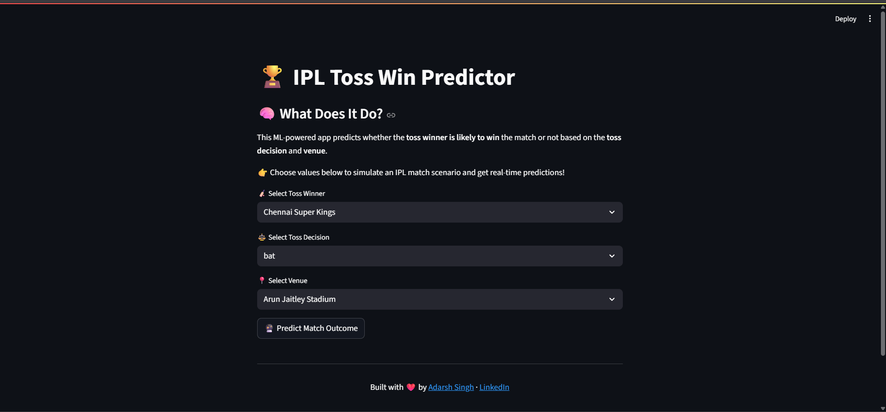
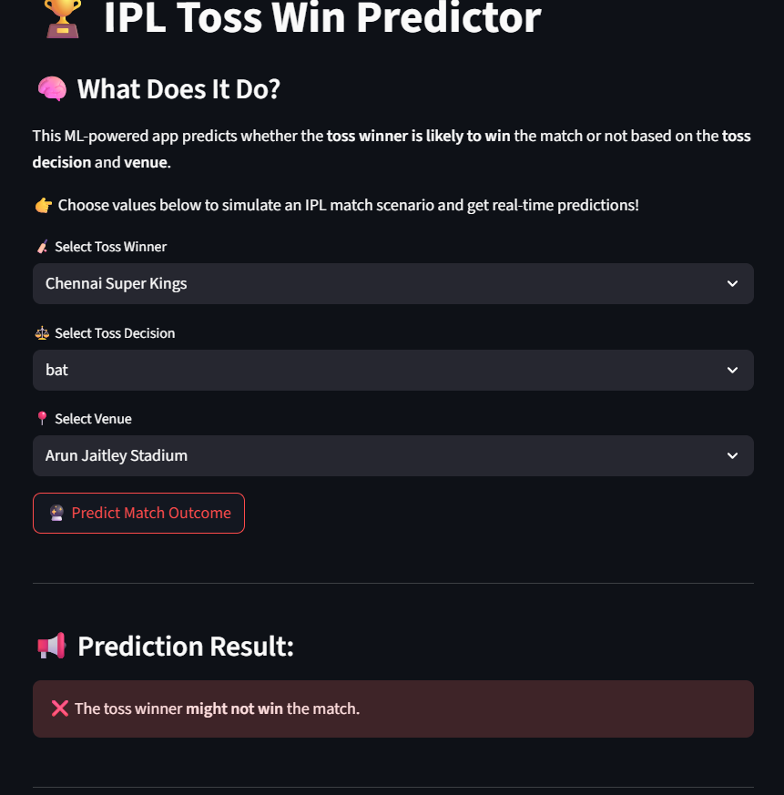

# 🏏 IPL Toss Win Predictor

The **IPL Toss Win Predictor** is a machine learning-powered web application that predicts whether the toss-winning team will win the match based on historical Indian Premier League (IPL) data.

Built using **Python**, **scikit-learn**, **pandas**, and **Streamlit**, this project is a practical demonstration of binary classification applied to real-world sports data.

---

## 🔴 Live Demo

👉 [Click here to try the deployed app](https://adarsh-1262-ipl-toss-win-predictor-ipl-toss-win-app-wgskck.streamlit.app/)

---

## 📌 Features

- ✅ Predict match outcomes based on:
  - Toss-winning team
  - Toss decision (Bat/Field)
  - Venue
- 🧠 Trained with Logistic Regression model
- 📊 Clean and minimal UI using Streamlit
- 📈 Accuracy and Confusion Matrix available during training
- 🔁 Fully interactive, accepts user inputs and gives real-time predictions

---

## 🧰 Tech Stack

| Tool         | Use                            |
|--------------|---------------------------------|
| Python       | Core language                   |
| pandas       | Data manipulation               |
| scikit-learn | Model training & evaluation     |
| joblib       | Saving trained model            |
| Streamlit    | Web app development             |

---

## 📁 Folder Structure

```

📦 IPL Toss Win Predictor
├── ipl_toss_win_app.py       # Streamlit web app
├── ml_win_predictor.py       # ML training script
├── toss_win_model.pkl        # Saved logistic regression model
├── columns.pkl               # Feature column encodings
├── requirements.txt          # Project dependencies
└── README.md                 # Project documentation

````

---

## 📷 Screenshots

> Add screenshots of your deployed app in a `screenshots/` folder and replace the placeholders below.

| 🏠 App Homepage | 🧠 Prediction Output |
|----------------|---------------------|
|  |  |

---

## 💡 How to Run Locally

### 1. Clone the Repository

```bash
git clone https://github.com/your-username/ipl-toss-win-predictor.git
cd ipl-toss-win-predictor
````

### 2. Install Dependencies

```bash
pip install -r requirements.txt
```

### 3. Run the App

```bash
streamlit run ipl_toss_win_app.py
```

---

## 🧪 Model Training (Optional)

If you want to retrain the model from scratch:

```bash
python ml_win_predictor.py
```

This will:

* Train a Logistic Regression model
* Evaluate its accuracy
* Save the model and column metadata using `joblib`

---

## 📈 Model Metrics

* **Accuracy**: \~57.8%
* **Confusion Matrix**:

  ```
  [[49 53]
   [39 77]]
  ```

---

## 👨‍💻 Author

Made with ❤️ by [Adarsh Singh](https://www.linkedin.com/in/adarsh-singgh)

* 📌 GitHub: [Github](https://github.com/adarsh-1262)
* 🌐 Portfolio: [Portfolio](https://adarshsingh07.netlify.app/)

---

## 📜 License

This project is licensed under the **MIT License**.
See [`LICENSE`](LICENSE) file for more details.

---

## ✨ Contributions

Pull requests are welcome. Feel free to fork the repo and submit improvements!

---

## 🙌 Acknowledgements

* IPL dataset sourced from Kaggle (manually cleaned and preprocessed)
* Thanks to the open-source community for tools like scikit-learn & Streamlit
---
